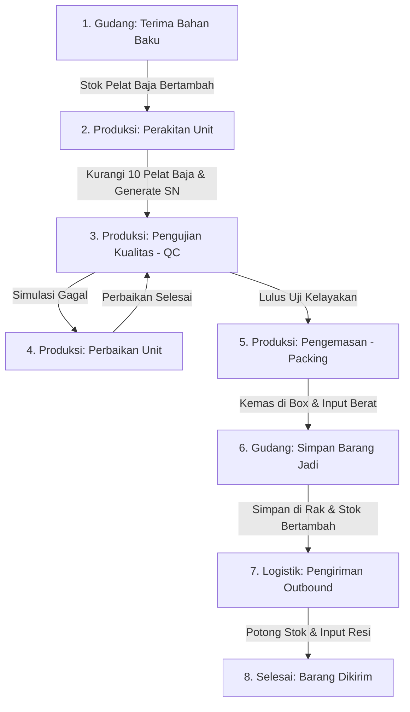

# FabricationPro - Industrial Operating System (v2.0)

**Link Stitch**: https://stitch.withgoogle.com/projects/9166540027214035469

FabricationPro adalah aplikasi Android berbasis Kotlin (Android Studio) yang dirancang untuk mengelola dan memantau alur kerja manufaktur secara digital, mulai dari penerimaan bahan baku, perakitan unit, pengujian kualitas (QC), pengemasan, hingga penyimpanan di gudang dan pengiriman logistik outbound.

Aplikasi ini menggunakan **Role-Based Access Control (RBAC)** secara ketat untuk menyelaraskan antarmuka pengguna dan wewenang tindakan sesuai tanggung jawab peran masing-masing di lapangan.

---

## 🔐 Kredensial Akses & Wewenang (Role-Based Access Control)

Aplikasi membatasi navigasi menu dan otorisasi tindakan secara ketat menggunakan kombinasi Peran, User ID, dan Access Code berikut:

1. **Operator (Lini Produksi)**
   * **Pilihan Peran**: Operator (Tombol kiri di Login)
   * **User ID**: `OP123` (Wajib) | **Access Code**: `123456` (Wajib)
   * **Menu Terbuka**: Dashboard, Produksi, Registri.
   * **Wewenang**: Melakukan perakitan unit baru, pengujian kelayakan QC, konfirmasi perbaikan unit, dan pengemasan (*Packing*).

2. **Staff Warehouse (Gudang & Logistik)**
   * **Pilihan Peran**: Warehouse (Tombol tengah di Login)
   * **User ID**: `WH888` (Wajib) | **Access Code**: `123456` (Wajib)
   * **Menu Terbuka**: Dashboard, Gudang (Logistik), Registri.
   * **Wewenang**: Menginput formulir penerimaan bahan baku, mengonfirmasi penyimpanan unit jadi ke rak gudang, dan memproses pengiriman outbound logistik.

3. **Plant Supervisor (Pengawas Shift)**
   * **Pilihan Peran**: Supervisor (Tombol kanan di Login)
   * **User ID**: `SP999` (Wajib) | **Access Code**: `123456` (Wajib)
   * **Menu Terbuka**: Dashboard, Gudang, Produksi, Registri, Monitoring (Semua menu).
   * **Wewenang (Mode Read-Only)**: Memantau detail unit dan diagram analitik kualitas tanpa izin memodifikasi data (tombol tindakan teknis dikunci). Dapat mengekspor laporan shift.

---

## 🔄 Alur Kerja Siklus Hidup Produk (Panel-X2)

Berikut adalah alur perjalanan unit dari bahan mentah hingga dikirim ke pelanggan:

### Detail Operasional:
1. **Penerimaan Bahan Baku**: Staff Warehouse menginput form penerimaan pelat baja dari supplier. Stok bahan baku bertambah.
2. **Perakitan Unit**: Operator merakit `Panel-X2` (memotong **10 unit** pelat baja). Hasil rakitan mendapatkan Serial Number (SN) baru dan berstatus `QC_PENDING`.
3. **Pengujian QC**: Operator menguji kelayakan unit dengan 3 pertanyaan evaluasi kualitas. Jika lulus berstatus `QC_PASSED`, jika gagal berstatus `QC_REJECTED`.
4. **Perbaikan Unit**: Operator memperbaiki unit berstatus `QC_REJECTED` hingga statusnya naik menjadi "Siap Uji Ulang" (`READY_FOR_RETEST`).
5. **Pengemasan (Packing)**: Operator memasukkan ID Box, berat (kg), dan catatan visual. Status naik menjadi `PACKED`.
6. **Penyimpanan Gudang**: Staff Warehouse memilih rak (A1, A2, B1, B2) untuk meletakkan box. Stok Barang Jadi bertambah. Status unit menjadi `FINISHED`.
7. **Pengiriman Outbound**: Staff Warehouse memasukkan nama ekspedisi dan nomor resi. Stok Barang Jadi berkurang. Status unit menjadi `SHIPPED` (Selesai).

---

## ⭐️ Fitur Unggulan Sistem

* **Viewfinder Kamera Terintegrasi (Embedded Scanner)**: Pemindai kamera fisik tertanam langsung pada card layout `ScanFragment` menggunakan `DecoratedBarcodeView` (dilengkapi kontrol senter fisik dan decoder luring gambar galeri).
* **Registri Data Unit Terpadu**: Halaman bank data unit (`RegistryFragment`) untuk melacak daftar unit berdasarkan filter kategori status (Semua, Dirakit, Lulus QC, Dikemas, Gudang) lengkap dengan kolom pencarian real-time.
* **Unduh QR Code Otomatis**: Fitur menyimpan QR Code Serial Number langsung ke galeri ponsel di album `/Pictures/FabricationPro/` untuk pencetakan label fisik.
* **Formulir Bottom Sheet Dialog (Material 3)**: Form penerimaan barang dan pengemasan tampil premium dalam dialog bottom sheet melengkung 20dp dari bawah layar dengan kontras warna teks dan tombol yang sempurna.
* **Ekspor Laporan ke HP**: Supervisor dapat mengekspor ringkasan shift produksi langsung ke folder unduhan internal ponsel di **`Downloads/FabricationPro/laporan_shift_a.txt`** (tanpa membutuhkan izin runtime tambahan) serta backup di PC.
* **Bento Grid Stats & Live Feed**: Dasbor ringkasan real-time dengan status kritis stok dan daftar log operasi terhangat.
* **Ikon Aplikasi Kustom**: Siluet pabrik industrial flat yang selaras dengan tema manufaktur modern.

---

## 🛠️ Teknologi Utama
* **Bahasa Pemrograman**: Kotlin
* **Penyimpanan Lokal**: Room Database (SQLite) dengan Coroutines Flow untuk sinkronisasi data real-time.
* **Desain UI/UX**: Google Material Design 3 (M3) dengan warna kustom *Industrial Clarity* berdaya kontras tinggi.
* **Pustaka Scanner**: ZXing Android Embedded untuk kamera viewfinder, dan ZXing Core untuk pembacaan QR galeri offline.

---

## Vidio
Link Video
Tugas Besar Pemogramman Mobile ([https://youtu.be/nslY2Iz2sk4](https://youtu.be/CAv930pe3OU))

Anggota:
1. Ariq Naufal Rabbani - 24552011302 - Beckend
2. Alif Ihsan Syamil - 24552011299 - Frontend
3. Donny Ahmad Gunawan - 24552011172 - Testing
